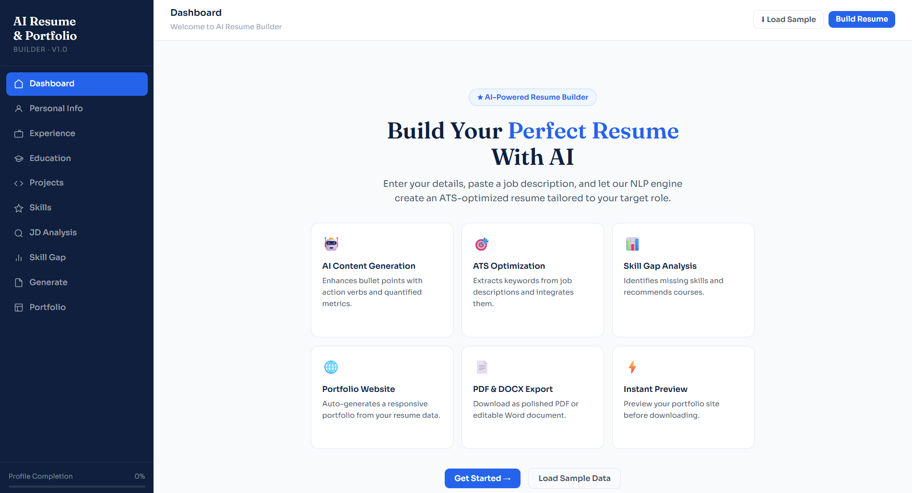

# SHUME 🚀

**Smart Human-centric Unified Machine-learning Engine**

SHUME is an AI-powered career intelligence platform that helps users analyze resumes, identify skill gaps, and discover personalized career pathways.

🔗 **[Live Demo](https://sansrkingsgod.github.io/SHUME/)**



## Features

- 📄 Resume Analysis
- 🎯 Career Recommendations
- 📊 Skill Gap Identification
- 🤖 AI-powered Insights
- 💻 User-friendly Dashboard
- 🌐 Auto-generated Portfolio Website
- 📑 PDF & DOCX Export

## Tech Stack

- Python
- FastAPI
- Scikit-learn (TF-IDF, Cosine Similarity)
- NLTK
- HTML / CSS / JavaScript

## How It Works

1. Enter your personal info, experience, education, and skills
2. Paste a job description for ATS-optimized tailoring
3. SHUME's NLP engine analyzes and enhances your content
4. Get skill-gap insights and course recommendations
5. Export as PDF, DOCX, or a live portfolio website

## Running Locally

The live demo above shows the frontend UI. To run the full application with AI features:

```bash
git clone https://github.com/SansrkingsGOD/SHUME.git
cd SHUME/backend
pip install -r requirements.txt
python3 main.py
```

Then open `frontend/index.html` in your browser.

## Status

🚧 Active Development

## Author

Sanjeev Raj K
